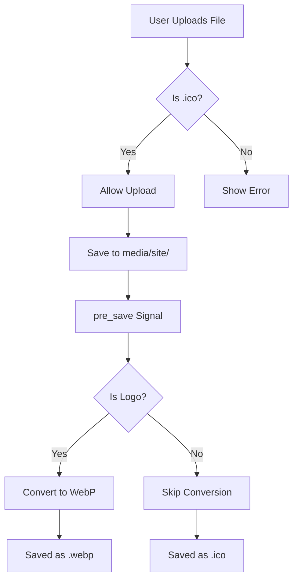

# Favicon Upload Validation - Implementation Guide

## Overview

Added validation and special handling for favicon uploads in the Site Settings admin panel to ensure:
1. Only `.ico` format files are accepted for favicon
2. Favicon files are NOT converted to WebP format (unlike other images)
3. Clear user feedback with helpful validation messages

---

## Changes Made

### 1. **Custom Validator Function** (`models.py`)

Added a new validator function to enforce `.ico` format:

```python
def validate_favicon(file):
    """
    Validator to ensure only .ico files are uploaded for favicon
    """
    ext = os.path.splitext(file.name)[1].lower()
    valid_extensions = ['.ico']
    if ext not in valid_extensions:
        raise ValidationError('Favicon dosyası sadece .ico formatında olmalıdır.')
```

### 2. **Updated Favicon Field** (`models.py`)

Changed `favicon` field from `ImageField` to `FileField` with validator:

```python
# Before:
favicon = models.ImageField(
    upload_to='site/', 
    blank=True, 
    verbose_name="Favicon",
    help_text="Tarayıcı sekmesinde görünen favicon (genellikle 32x32 piksel)"
)

# After:
favicon = models.FileField(
    upload_to='site/', 
    blank=True, 
    validators=[validate_favicon],
    verbose_name="Favicon",
    help_text="Tarayıcı sekmesinde görünen favicon - Sadece .ico formatı kabul edilir (genellikle 32x32 piksel)"
)
```

**Why FileField instead of ImageField?**
- `FileField` accepts any file type (with validation)
- `.ico` files are not standard images (can contain multiple resolutions)
- More flexible for browser compatibility

### 3. **Updated Signal Handler** (`signals.py`)

Modified the `optimize_site_settings_images` signal to skip favicon conversion:

```python
@receiver(pre_save, sender=SiteSettings)
def optimize_site_settings_images(sender, instance, **kwargs):
    """Convert site settings images (logo only) to WebP - Skip favicon (.ico files)"""
    # Logo - Convert to WebP
    if instance.logo and hasattr(instance.logo, 'file'):
        if not instance.logo.name.endswith('.webp'):
            instance.logo = optimize_image(
                instance.logo,
                max_width=500,
                max_height=500,
                quality=90
            )
    
    # Favicon - DO NOT convert .ico files to WebP
    # .ico files should remain in their original format for browser compatibility
    # No conversion needed for favicon
```

### 4. **Updated Admin Help Text** (`admin.py`)

Enhanced the admin panel description with clear instructions:

```python
('Marka ve Kimlik', {
    'fields': ('logo', 'favicon'),
    'description': '<strong>Logo:</strong> Sitenizin logosunu yükleyin (PNG, JPG veya WebP formatında).<br>'
                   '<strong>Favicon:</strong> Tarayıcı sekmesinde görünen ikonu yükleyin. '
                   '<strong>Sadece .ico formatı kabul edilir</strong> (32x32 veya 16x16 piksel önerilir).'
}),
```

### 5. **Database Migration**

Created migration: `0014_update_favicon_field.py`

---

## How It Works

### Upload Process:

1. **User uploads favicon in Django Admin**
   - Goes to: Admin → Site Settings → Marka ve Kimlik
   - Clicks on "Favicon" field
   - Selects file

2. **Validation Check**
   - `validate_favicon()` function runs
   - Checks file extension
   - If NOT `.ico` → Shows error: "Favicon dosyası sadece .ico formatında olmalıdır."
   - If `.ico` → Allows upload

3. **Save Process**
   - `pre_save` signal fires
   - Logo gets converted to WebP (optimized)
   - **Favicon is skipped** (no conversion)
   - Files saved to `media/site/` directory

---

## Why .ico Format?

### Browser Compatibility
- `.ico` format is universally supported by all browsers
- Can contain multiple image sizes (16x16, 32x32, 48x48, etc.) in one file
- Browsers automatically pick the best size

### Why NOT WebP for Favicon?
- Not all browsers support WebP favicons
- `.ico` is the standard format (since IE6)
- Better compatibility with bookmarks, browser tabs, and desktop shortcuts

---

## Creating a Favicon

### Option 1: Online Tools
- **Favicon.io**: https://favicon.io/
  - Free favicon generator
  - Supports text, emoji, or image to .ico conversion

- **RealFaviconGenerator**: https://realfavicongenerator.net/
  - Comprehensive favicon generator
  - Creates all sizes automatically

### Option 2: Design Software
```bash
# Using ImageMagick (macOS/Linux)
convert -resize x32 -gravity center -crop 32x32+0+0 logo.png favicon-32.png
convert -resize x16 -gravity center -crop 16x16+0+0 logo.png favicon-16.png
convert favicon-32.png favicon-16.png favicon.ico
```

### Recommended Sizes:
- **16x16px** - Browser tab (small)
- **32x32px** - Browser tab (standard)
- **48x48px** - Desktop shortcut (Windows)

---

## Testing

### 1. **Test Validation**

**Upload a non-.ico file (e.g., PNG):**
```
Expected Result: ❌ Error message appears
"Favicon dosyası sadece .ico formatında olmalıdır."
```

**Upload a .ico file:**
```
Expected Result: ✅ Upload succeeds
File saved to: media/site/favicon_xyz.ico
```

### 2. **Test No WebP Conversion**

**Check uploaded file:**
```bash
ls -la /Users/mac/Desktop/emlakcı2/media/site/

# Should show:
favicon.ico  (NOT favicon.webp)
logo.webp    (Logo IS converted)
```

### 3. **Test Browser Display**

**Check favicon in browser:**
1. Upload favicon in admin
2. Visit your website
3. Check browser tab - favicon should appear
4. Right-click tab → Inspect
5. Check HTML `<head>`:
```html
<link rel="icon" type="image/x-icon" href="/media/site/favicon.ico">
```

---

## Deployment Steps

### 1. **Apply Migration**
```bash
cd /Users/mac/Desktop/emlakcı2
python manage.py migrate properties
```

### 2. **Upload Favicon**
1. Login to Django Admin
2. Go to **Site Settings**
3. Under **"Marka ve Kimlik"**:
   - Upload logo (PNG/JPG - will auto-convert to WebP)
   - Upload favicon (**.ico only** - will NOT convert)
4. Click **Save**

### 3. **Verify**
```bash
# Check media folder
ls -la media/site/

# Expected files:
logo.webp
favicon.ico
```

### 4. **Production Deployment**

If using DigitalOcean Spaces:
```bash
# Upload media files to CDN
aws s3 cp media/site/favicon.ico \
    s3://cekfisi/realInvest/media/site/favicon.ico \
    --endpoint-url=https://fra1.digitaloceanspaces.com
```

---

## Troubleshooting

### Issue 1: "Favicon dosyası sadece .ico formatında olmalıdır" Error

**Cause:** Trying to upload non-.ico file

**Solution:**
1. Convert your image to `.ico` format using:
   - https://favicon.io/
   - https://convertio.co/png-ico/
2. Upload the generated `.ico` file

### Issue 2: Favicon Not Showing in Browser

**Possible Causes:**

#### A. Browser Cache
**Solution:**
```bash
# Hard refresh browser
Ctrl+F5 (Windows/Linux)
Cmd+Shift+R (Mac)

# Or clear browser cache
```

#### B. Wrong File Path
**Check:**
```html
<!-- In base.html, should be: -->
<link rel="icon" type="image/x-icon" href="{{ global_site_settings.favicon.url }}">
```

#### C. File Not Uploaded to CDN (Production)
**Solution:**
```bash
# Check if file exists in DigitalOcean Spaces
aws s3 ls s3://cekfisi/realInvest/media/site/ \
    --endpoint-url=https://fra1.digitaloceanspaces.com

# Upload if missing
aws s3 cp media/site/favicon.ico \
    s3://cekfisi/realInvest/media/site/ \
    --endpoint-url=https://fra1.digitaloceanspaces.com
```

### Issue 3: "ValidationError at /admin/properties/sitesettings/"

**Cause:** Migration not applied

**Solution:**
```bash
python manage.py migrate properties
```

---

## Technical Details

### File Type Differences

| Field | Format | Converted to WebP? | Reason |
|-------|--------|-------------------|---------|
| Logo | PNG/JPG/WebP | ✅ Yes | Modern browsers support, smaller size |
| Favicon | .ICO only | ❌ No | Universal compatibility, multi-size support |

### Validation Flow



### Security Considerations

**File Validation:**
- Extension checking prevents malicious files
- Only `.ico` files accepted
- Django's FileField provides additional security

**Storage:**
- Files stored in `media/site/` directory
- Separate from user-uploaded content
- Served through CDN in production

---

## Best Practices

### 1. **Favicon Size**
```
Recommended: 32x32px (most common)
Also create: 16x16px, 48x48px for comprehensive support
Format: .ICO (multi-resolution)
```

### 2. **Logo Size**
```
Recommended: 500x500px max
Format: PNG (with transparency) or JPG
Auto-converts to WebP for optimization
```

### 3. **Testing Checklist**
- [ ] Upload favicon in admin
- [ ] Check validation works (try uploading .png)
- [ ] Verify file is NOT converted to WebP
- [ ] Test favicon appears in browser tab
- [ ] Test on multiple browsers (Chrome, Firefox, Safari)
- [ ] Check mobile browsers

---

## Related Files

- `properties/models.py` - Validator and field definition
- `properties/signals.py` - WebP conversion logic
- `properties/admin.py` - Admin panel configuration
- `properties/migrations/0014_update_favicon_field.py` - Database migration
- `templates/base.html` - Favicon display in HTML

---

**Last Updated**: 2025-10-15  
**Status**: ✅ Implemented and Ready for Deployment
